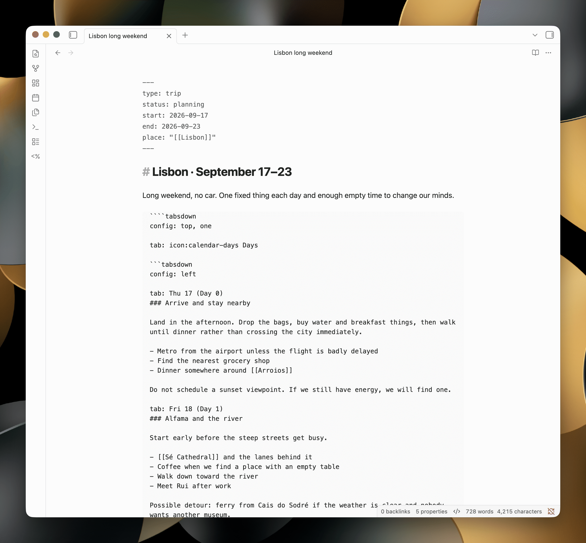

# Tabsdown

Tabsdown turns ordinary Markdown into theme-native tabs in Obsidian. Tabs can contain notes, queries, embeds, callouts, math, Mermaid diagrams, and compatible community-plugin blocks.



## What it does

- Keeps each tab set in a fenced `tabsdown` block, so the note stays readable Markdown.
- Works in Reading View and Live Preview on desktop and mobile.
- Supports nested tabs, formatted labels, Lucide icons, and tab lists on any side.
- Uses Obsidian's Markdown renderer, so links, embeds, and compatible plugin blocks keep working.
- Matches the active theme and can be adjusted with Style Settings or CSS snippets.

## Syntax

Start each tab with a column-zero `tab: <label>` marker. A block needs at least two non-empty, unique labels. Add optional block settings on a column-zero `config: <values>` line before the first tab, such as `config: top, multi`; later position or layout values win.

`````markdown
````tabsdown
tab: Greedy

Greedy chooses the largest usable coin.

tab: Dynamic programming

```dataview
TABLE file.mtime
FROM "Algorithms"
```
````
`````

Use matching backtick or tilde fences. The outer fence must be longer than any matching fence inside it. The example uses four backticks outside and three around the Dataview query. Increase the outer fence again if a tab body contains a longer fence.

````markdown
~~~tabsdown
config: top, multi

tab: Python
print("Hello Tabsdown")

tab: JavaScript
console.log("Hello Tabsdown");
~~~
````

`top`, `left`, `right`, and `bottom` place the tab list; `one` keeps it on one scrollable line and `multi` wraps labels. The first tab starts active. Empty tab bodies are valid. To render a literal marker-looking line, escape it as `\tab:`.

### Icons

Start a label with `icon:<name>` to put one of Obsidian's bundled [Lucide](https://lucide.dev/icons/) icons before it:

````markdown
```tabsdown
tab: icon:code Python
tab: icon:file-text Notes
```
````

An unknown icon name renders no icon, and every tab still needs a label. Escape a literal label as `tab: \icon:name`.

### Label formatting

Labels support exactly `**bold**`, `*italic*`, `~~strikethrough~~`, and backtick inline code. The same formatting works after an `icon:<name>` prefix and in public `mountTabs` labels. Multiple non-overlapping formats can share one label.

Links, wikilinks, images, raw HTML, headings, lists, and other Markdown stay visible as literal text. Unmatched, nested, overlapping, empty, or whitespace-only delimiter runs also stay literal; labels never create links or other interactive descendants.

### Nested tabs

A tab body can hold another `tabsdown` block, as long as its fence is shorter than the one around it:

`````markdown
````tabsdown
tab: Backend

```tabsdown
tab: Python
tab: Go
```

tab: Frontend
`````

Markers inside a nested block belong to that block, so the inner `tab:` lines above do not split the outer one and need no escaping. Each level places its own tab list and keeps its own active tab. A `config:` line applies only to the level that declares it.

## Obsidian modes

| Mode | Behavior |
| --- | --- |
| Reading View | Interactive tabs on desktop and mobile. Switching tabs never edits the note. |
| Live Preview | Interactive tabs while the cursor is outside the block; fenced source while editing inside it. |
| Source Mode | Raw fenced Markdown only. |

## Installation

### Community plugins

Use this method after Tabsdown is listed in Obsidian's Community Plugins directory:

1. Open **Settings → Community plugins**.
2. Select **Browse**, search for **Tabsdown**, then select **Install**.
3. Select **Enable**.

### BRAT

Published releases and prereleases can be installed with [BRAT](https://github.com/TfTHacker/obsidian42-brat):

1. Install and enable **Obsidian42 - BRAT** from Community Plugins.
2. Run **BRAT: Add a beta plugin for testing** from the command palette.
3. Enter `grafanaKibana/obsidian-tabsdown`.
4. Enable **Tabsdown** under **Settings → Community plugins**.

BRAT can install only a published release or prerelease, not an unpublished draft.

### Manual installation

1. Download `main.js`, `manifest.json`, and `styles.css` from the same [GitHub release](https://github.com/grafanaKibana/obsidian-tabsdown/releases).
2. Create `<Vault>/.obsidian/plugins/tabsdown/`.
3. Copy the three downloaded files directly into that directory.
4. Reload Obsidian.
5. Enable **Tabsdown** under **Settings → Community plugins**.

Do not mix assets from different releases.

## Guides

- [Publish Tabsdown blocks with Quartz](docs/quartz.md)
- [Embed plugin-owned panels with `mountTabs`](docs/embedding-tabs.md)
- [Configure Tabsdown with Style Settings](docs/style-settings.md)
- [Customize Tabsdown with CSS snippets](docs/css-snippets.md)
- [Generate Tabsdown blocks with Templater](docs/templater.md)

## Troubleshooting

- **Fenced source instead of tabs:** Enable Tabsdown, switch to Reading View, or move the cursor outside the block in Live Preview.
- **Diagnostic shown:** Check that `tab:` markers start at column zero, labels are unique, and the block has at least two tabs.
- **An inner code block closes Tabsdown:** Make the outer fence longer than every fence inside it, or use tildes.
- **An embed or plugin block fails:** Test the same Markdown outside Tabsdown first.
- **Still stuck:** [Open an issue](https://github.com/grafanaKibana/obsidian-tabsdown/issues) with the source block, Obsidian version, theme, and any related plugins.

## Development and releases

- [Contributing and local development](CONTRIBUTING.md)
- [Issues](https://github.com/grafanaKibana/obsidian-tabsdown/issues)
- [Releases and changelog](https://github.com/grafanaKibana/obsidian-tabsdown/releases)

Tabsdown runs entirely inside Obsidian and makes no network requests. It collects no telemetry, requires no account or payment, shows no advertising, accesses only files inside the vault, and includes no closed-source components.

## License

[MIT](LICENSE)
