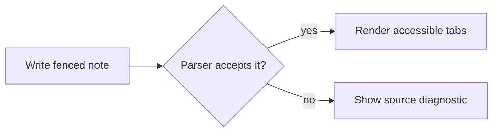

---
tags:
  - test
---

# Tabsdown test matrix

A practical workspace that also exercises every syntax and rendering variation. Open it in Reading View and treat each section like a small product, engineering, or research note.

## Style Settings QA

Reuse the Positions, Icons, and Labels sections below while changing settings; no duplicate blocks are needed.

| Check | Expected |
| --- | --- |
| Leave every Top/Bottom/Left/Right override on **Inherit defaults**, then change each global Personality, Palette, and Alignment value. | All four positions follow the globals; any `mountTabs` demo remains global-only. |
| Try Button, Underline, Separator, and Rail globally, then reverse each with every position override. | Only that position changes. Separator is centered between tabs, spans 80% of their cross-axis, and is absent at wrapped row/column starts. Rail has a larger padded rounded track and shorter desktop tabs while preserving 44px coarse-pointer targets. |
| Try Underline placement Auto/Top/Right/Bottom/Left and thickness 1/2/8. | Auto is bottom for Top/Bottom, right for Left, and left for Right—even when a narrow side list becomes a row. Explicit placement wins without hover/selection layout shifts. |
| Hover selected and unselected tabs, switch Primary/Secondary, then try gap 0/48 in Scroll/Wrap, content spacing 0/12/48, and selected weight Thinner/Default/Bolder. | Primary accents selected Separator text and the Rail segment; Secondary remains neutral. Only selected/expanded labels change weight at 400/600/700, without changing tab width. |
| Change horizontal padding directly to 0/36/48 in Default and Compact. | Each slider change applies immediately without a separate toggle and overflow remains usable. |
| Change side-list width directly to 192/256/320 on Left/Right, try every Alignment option, and resize narrowly. | Each slider change applies immediately on wide lists; tabs remain equal width regardless of Alignment; narrow lists return to an equal-width full-width row and panels remain visible. |
| Set icon size 12/32 and spacing 0/16, using the Icons section. | Icon boxes and gaps change without moving plain-label tabs off baseline. |
| In Nested blocks, switch Nested block style between Card and Flat while viewing section 9 with Primary and Secondary palettes. | Card shows a bordered nested surface; Flat shows tabs directly under their parent without a wrapper surface; nested surfaces remain subtle while Primary selected Separator text and Rail segments stay accented. |
| Use the long Labels block with Scroll, Wrap, Equal width, Left/Right, and narrow panes. | Complete equal-width rows align their columns and gaps; an incomplete final row expands evenly to fill the list; panels never collapse to zero. |
| Toggle theme button outline and test mouse hover, keyboard focus, touch taps, reduced motion, light/dark themes, and rapid setting changes. | Theme shadow toggles without replacing the focus outline; hover never sticks on touch; motion and selected state remain correct. |

## 1. Positions

```tabsdown
config: top

tab: Installation notes
1. Copy the plugin files into `.obsidian/plugins/tabsdown/`.
2. Enable **Tabsdown** under Community plugins.
3. Open this note in Reading View and switch between panels.

> [!tip] Quick check
> The selected tab should remain visible after reopening the note.
tab: Configuration reference
Use `config: top`, `left`, `right`, or `bottom` to place the tab list. Add `one` for a scrollable row or `multi` to allow wrapping.
tab: Migration from version one
- [x] Rename legacy fences to `tabsdown`
- [x] Keep every `tab:` marker at column zero
- [ ] Review custom CSS snippets for old class names
```

```tabsdown
config: left

tab: Installation notes
### Local development

Run `npm install`, then `npm run dev`. Reload Obsidian after rebuilding the plugin bundle.
tab: Configuration reference
The left list uses a configurable width on wide panels and moves above the content when the block becomes narrow.
tab: Migration from version one
Existing labels and panel Markdown remain unchanged; only the fence language and any legacy CSS selectors need migration.
tab: Troubleshooting a failed sync
Check that `main.js`, `manifest.json`, and `styles.css` were copied together. A stale stylesheet can make a current bundle look broken.
```

```tabsdown
config: right

tab: Installation notes
Install the release assets together, then restart Obsidian so the plugin registry and stylesheet refresh at the same time.
tab: Configuration reference
Right-positioned tabs remain first in reading order while appearing beside the panel on wide layouts.
tab: Migration from version one
Verify keyboard navigation, saved CSS snippets, and any notes that use nested fenced blocks.
tab: Troubleshooting a failed sync
Compare the plugin folder against the release checksums, then disable and re-enable Tabsdown before testing again.
```

```tabsdown
config: bottom

tab: Installation notes
For a vault-wide install, distribute the three release assets and document the minimum supported Obsidian version for collaborators.
tab: Configuration reference
Bottom placement keeps the content first and moves the tab list below it without changing keyboard order.
tab: Migration from version one
Finish by checking desktop and mobile themes, long labels, and any tab panels that contain embeds or queries.
```

## 2. Overflow: one vs multi

```tabsdown
config: one

tab: Authentication and sessions
Access tokens expire after 15 minutes; refresh tokens rotate after every successful renewal.
tab: Background job scheduling
Daily exports run at 02:00 UTC with exponential retry and an operator-visible dead-letter queue.
tab: Content addressable storage
Attachments are deduplicated by SHA-256 while note metadata retains the original filename.
tab: Distributed tracing spans
API, queue, and worker spans share the request ID so a delayed job can be followed end to end.
tab: Eventual consistency notes
Search results may lag writes by up to 30 seconds; the detail view always reads from the primary store.
tab: Feature flag rollout plan
Enable for staff, then 5%, 25%, and 100% of workspaces with error-rate gates between stages.
```

```tabsdown
config: multi

tab: Authentication and sessions
Access tokens expire after 15 minutes; refresh tokens rotate after every successful renewal.
tab: Background job scheduling
Daily exports run at 02:00 UTC with exponential retry and an operator-visible dead-letter queue.
tab: Content addressable storage
Attachments are deduplicated by SHA-256 while note metadata retains the original filename.
tab: Distributed tracing spans
API, queue, and worker spans share the request ID so a delayed job can be followed end to end.
tab: Eventual consistency notes
Search results may lag writes by up to 30 seconds; the detail view always reads from the primary store.
tab: Feature flag rollout plan
Enable for staff, then 5%, 25%, and 100% of workspaces with error-rate gates between stages.
```

## 3. Config precedence

Later position and layout values win: expect `bottom` + `multi`.

```tabsdown
config: top, one
config: left
config: bottom, multi

tab: Resolved position and layout
This list should render below the panel and wrap when needed. The final value for each configuration axis wins.
tab: Second panel
Use this panel to confirm that duplicate `config:` lines do not leak into rendered content.
```

Single line, reversed order, whitespace around values.

```tabsdown
config:  multi ,  right

tab: Resolved position and layout
This block should place its list on the right and allow multiple rows when the available inline space is exhausted.
tab: Second panel with a much longer label
Resize the note until the side list moves above the panel; the active content must remain readable throughout the transition.
```

## 4. Icons

````tabsdown
tab: icon:code Code
```ts
const release = { version: "1.3.3", channel: "preview" };
```
tab: icon:file-text Notes
- Decision: keep theme-native colors
- Owner: plugin maintainers
- Review: before release candidate
tab: icon:not-a-real-icon-name Unknown
The missing icon is ignored, but this label and panel remain available.
tab: No icon
Use a plain label when an icon would add noise rather than meaning.
tab: icon:git-branch ✅ Unicode ✨ 中文 label
Localization review: English, emoji, and 中文 remain legible in the same tab label.
````

Escaped icon token — label should read literally `icon:code Not an icon`.

```tabsdown
tab: \icon:code Not an icon
Use the escaped form when documentation needs to show the literal `icon:code` prefix.
tab: Second panel
The neighboring panel confirms that escaping one label does not affect the rest of the block.
```

## 5. Labels

```tabsdown
tab: A very long label that should force the tab list to overflow or wrap depending on the layout value
This release-readiness summary deliberately uses a long label so Scroll, Wrap, and Equal width can be compared without collapsing the text.
tab: **Bold** *italic* ~~removed~~ `code()`
The four supported, non-overlapping inline formats render inside the label.
tab: icon:code **Formatted icon label**
The icon stays hidden from assistive technology and the formatted remainder names the tab.
tab: [literal link](https://example.com)  <b>literal HTML</b>
Links, images, and raw HTML remain visible text and create no interactive label descendants.
tab: **** | ** ** | ~~~~ | ``
Empty and whitespace-only delimiter runs remain literal and nonblank.
tab: **outer *nested* text** and ***overlap***
Nested and overlapping formatting remains literal.
tab: \*escaped\* and \\
Escaped delimiters and backslashes render literally.
tab: 1
Quarter-one planning notes and the current delivery target.
tab: ・
Punctuation-only labels remain valid for compact visual workflows.
tab: release-readiness-owner-handoff-checklist-without-any-natural-break-opportunities-0123456789abcdefghijklmnopqrstuvwxyz
This deliberately unbroken label must stay inside the note when Equal width and Wrap are enabled together.
```

For the mounted API, repeat with group label `**Trace** details`, labels `**Strong**`, `*Em*`, `~~Delete~~`, and `` `Code` ``, then hide the first, middle, and last control. The group name must read “Trace details”; formatting descendants must activate their button; Separator must remain centered only between visible controls on the same visual line; `destroy()` must restore every panel.

## 6. Bodies

Empty and whitespace-only bodies are valid.

```tabsdown
tab: Empty
tab: Whitespace only

   
tab: Has content
The empty panels above are intentional; this one confirms that a later non-empty panel still renders normally.
```

Mixed Markdown, one tab per feature.

`````tabsdown
tab: Headings + text

# Project Atlas
## Release 1.3.3
### Objective

Ship **extended Style Settings** without changing the authoring syntax. The release keeps *theme-native behavior*, documents `tabsdown` configuration, and links to the [Obsidian documentation](https://obsidian.md)[^1].

[^1]: External documentation is useful for collaborators who are new to Reading View and Community plugins.

tab: Lists

- Release scope
  - Nested Card and Flat styles
    - Distinct subtle coloring for deeper levels
  - Position-specific appearance overrides
1. Build and synchronize the demo vault
2. Run tests, lint, typecheck, and release verification

- [x] Preserve keyboard and touch behavior
- [ ] Complete light/dark visual review

tab: Table

| Area | Owner | Status |
| :--- | :---: | ---: |
| Parser compatibility | Core | Ready |
| Responsive side-list behavior in narrow desktop and mobile panes | UI | Review |

tab: Callouts

> [!info] Release candidate
> All automated checks pass and the demo bundle matches the source stylesheet.

> [!warning]- Remaining visual review
> Expand this callout to record any alternate-theme or mobile findings.

> [!quote] Design principle
> > [!tip] Theme native
> > Prefer Obsidian variables over a hard-coded product palette.

tab: Code fences

```js
const release = { plugin: "tabsdown", fence: "backtick" };
console.log(`${release.plugin} is ready for preview`);
```

~~~python
print("Verify tilde fences inside a backtick Tabsdown block")
~~~

    npm run check

tab: Math

If each stage keeps $p = 0.99$ of requests healthy, four independent stages retain $p^4$ of the original success rate:

$$
p_{end\text{-}to\text{-}end} = \prod_{i=1}^{4} p_i
$$

tab: Mermaid



tab: Links + embeds

- resolved: [[Launch workspace]]
- unresolved: [[No such note here]]
- heading link: [[Launch workspace#Shared launch notes]]
- embed: ![[Launch workspace#Shared launch notes]]
- external image: 

tab: HTML + raw

<div style="border: 1px solid var(--text-accent); padding: 4px;">
  Release status: ready for visual review
</div>

<details><summary>Deployment notes</summary>Publish the release assets together and verify their checksums.</details>

Horizontal rule:

---

tab: Tall panel

- [x] Confirm release scope
- [x] Update Style Settings metadata
- [x] Preserve global defaults
- [x] Preserve position overrides
- [x] Add nested Card styling
- [x] Add nested Flat styling
- [x] Add subtle nested colors
- [x] Check underline hover geometry
- [x] Check long labels
- [x] Check equal-width overflow
- [x] Check wrapped gaps
- [x] Check side-list width
- [x] Check icon sizing
- [x] Check content spacing
- [x] Check selected weight
- [x] Sync demo stylesheet
- [x] Run lint
- [x] Run typecheck
- [x] Run automated tests
- [ ] Complete final visual review

tab: Short panel

No release blockers. Switching between this summary and the checklist exercises the height animation.
`````

## 7. Escaped markers

Literal `tab:` and `config:` lines inside a body.

```tabsdown
tab: Escaped marker
\tab: keep this literal marker in the migration guide
The escaped line remains part of this panel's documentation.

tab: Config-looking body
config: top
The line above is a configuration example in the body, not block configuration, because it follows a tab marker.
```

## 8. Tilde fences

~~~tabsdown
config: left

tab: Tilde-fenced block
Use tilde fences when the panel needs to demonstrate an inner backtick code block.
tab: Second panel of the tilde block
Both fence styles should render the same accessible tab interaction.
~~~

## 9. Nesting

Four levels. Each level keeps its own config and active tab.

``````tabsdown
config: top, multi

tab: Release planning workspace

The parent panel summarizes the release while the nested blocks keep workstream details close to the decision that needs them.

`````tabsdown
config: left

tab: Engineering workstreams

Owners use the inner tabs to switch between rollout details without leaving the release note.

````tabsdown
config: bottom

tab: API rollout
Ship the read path first, monitor error budgets, then enable writes for staff workspaces.

```tabsdown
tab: Staged enablement
Move from staff to 5%, 25%, and 100% only while error and latency budgets remain healthy.
tab: Rollback trigger
Disable the flag when the five-minute error rate exceeds the release threshold.
```

tab: Data migration
Backfill in batches of 500 records and pause automatically when replication lag exceeds 30 seconds.
````

tab: Documentation workstream
Update installation, migration, and troubleshooting guides before the release candidate is published.
`````

After the workstream details, the parent note can continue with shared decisions, launch dates, and final approval.

tab: Support playbooks

This panel is entirely organized by a nested block:

`````tabsdown
tab: Customer reports
Capture the vault type, Obsidian version, theme, and exact fence before reproducing a rendering issue.
tab: Known workarounds
Reload the app after replacing plugin assets and disable conflicting CSS snippets during diagnosis.
`````

tab: Release summary

Version 1.3.3 expands visual controls while keeping the Markdown contract and accessible interaction unchanged.
``````

Nested with mixed fence characters.

~~~~tabsdown
tab: Research notebook

The outer tilde fence leaves room for an ordinary backtick-fenced Tabsdown block inside the literature note.

```tabsdown
tab: Sources to review
- Obsidian theme variable guidance
- Accessibility notes for tab-like navigation
tab: Findings
Nested blocks need clear hierarchy without introducing a fixed palette.
```

tab: Research decisions
Use theme-derived tints and keep the authoring syntax independent at every level.
~~~~

Nested block inside a callout inside a tab.

`````tabsdown
tab: Architecture decision

> [!info] Choose a nested presentation
> ````tabsdown
> tab: Card surface
> Use a bordered surface when the nested group should read as a self-contained reference.
> tab: Flat tabs
> Use tabs directly in the parent panel when hierarchy is already clear from the surrounding note.
> ````

tab: Decision outcome
Card remains the default for compatibility; Flat is available through Style Settings.
`````

## 10. Stress

Twenty tabs, `one` layout.

```tabsdown
config: one

tab: 01 Overview
Release goal, audience, and the user-visible outcome.
tab: 02 Goals
Success means more visual control without changing note syntax.
tab: 03 Scope
Style Settings, nested presentation, responsive spacing, and hover fixes.
tab: 04 Timeline
Implementation, visual review, release candidate, and staged publication.
tab: 05 Owners
Engineering owns behavior; documentation owns migration and examples.
tab: 06 Risks
Theme variance, narrow layouts, touch hover, and long localized labels.
tab: 07 Decisions
Card remains the nested default; Flat removes only the wrapper surface.
tab: 08 Design
Theme variables provide hierarchy without a Tabsdown-specific palette.
tab: 09 API
No parser or programmatic mounting API changes are required.
tab: 10 Data
No note migration or persisted plugin data migration is required.
tab: 11 Security
Panels continue to render through Obsidian's Markdown renderer.
tab: 12 QA
Run automated checks and review desktop, mobile, light, and dark themes.
tab: 13 Rollout
Publish a preview, collect vault feedback, then promote the release.
tab: 14 Metrics
Track rendering errors, support reports, and release adoption.
tab: 15 Support
Ask for the note source, theme, Obsidian version, and a screenshot.
tab: 16 Training
Show authors the fence syntax, nested blocks, and Style Settings groups.
tab: 17 Budget
The change is CSS-only and requires no new runtime dependency.
tab: 18 Legal
Third-party documentation links remain external references only.
tab: 19 Changelog
Summarize new settings, defaults, fixes, and compatibility notes.
tab: 20 Archive
Keep final screenshots, checksums, and verification output with the release.
```

## 11. Asynchronous content

These workspace views fill their panel after the Markdown renderer resolves. Switch away and back
between each of them and the compact status panel, repeatedly: the panel box must hold
the outgoing height until the content lands and then resize once. A collapse to
nothing followed by a spring open is the bug.

The embed row needs no plugins. The query rows need Dataview and Datacore; without
them they render as plain code fences and prove nothing.

`````tabsdown
tab: Embedded note

![[Launch workspace]]

tab: Recently modified notes

```dataview
TABLE file.mtime AS Modified
FROM ""
SORT file.mtime DESC
LIMIT 15
```

tab: Delayed reading queue

```dataviewjs
await new Promise((resolve) => setTimeout(resolve, 800));
dv.list(dv.pages().file.name.slice(0, 10));
```

tab: Vault inventory

```datacorejsx
return function View() {
	const pages = dc.useQuery("@page");
	return <p>{pages.length} pages indexed</p>;
}
```

tab: Brand reference


tab: Compact status

No recent indexing issues. This compact summary is the height the query panels must not flash through.
`````

Async content inside a nested block: the outer panel resizes while the inner one
is still filling.

`````tabsdown
tab: Outer with a nested query

The release dashboard nests an index-backed report inside the current milestone panel.

````tabsdown
tab: Recently updated notes

```dataview
LIST
FROM ""
LIMIT 10
```

tab: Index status
The workspace index is healthy and ready for the next scheduled refresh.
````

tab: Milestone summary

The current milestone has no open documentation blockers.
`````

## 12. Diagnostics

Each block below is intentionally invalid and should render a diagnostic with the source preserved.

`too-few-tabs`

```tabsdown
tab: Only one
This draft forgot to include a second comparison panel.
```

`empty-label`

```tabsdown
tab:
The onboarding checklist was accidentally given an empty label.
tab: Second panel
This valid sibling helps confirm the diagnostic points to the empty label.
```

`duplicate-label`

```tabsdown
tab: Repeated label
Initial rollout notes for staff workspaces.
tab: Repeated label
Public rollout notes accidentally reused the same label.
```

`content-before-first-tab`

```tabsdown
Release context was placed before the first tab marker.

tab: Rollout plan
Enable the feature in stages.
tab: Rollback plan
Disable the flag and restore the previous stylesheet.
```

`invalid-config` — unknown value

```tabsdown
config: sideways

tab: Deployment
The requested `sideways` placement is not supported.
tab: Recovery
Choose top, bottom, left, or right instead.
```

`invalid-config` — empty value list

```tabsdown
config:

tab: Deployment
The configuration line needs at least one value.
tab: Recovery
Remove the empty line or provide a supported placement or layout.
```

`unclosed-nested-block` — reports the opening line of the inner block

`````tabsdown
tab: Release workstreams

````tabsdown
tab: Engineering
The inner block never closes, so the remaining release panels are swallowed.
tab: Documentation
This marker still belongs to the unclosed inner block.

tab: Support
This panel is swallowed as well.
`````

Config after the first tab is body text, not config, so this renders `top`/`one` with a literal line.

```tabsdown
tab: Current behavior
The block keeps its default top position.
config: bottom
tab: Migration note
The `config: bottom` line above is rendered as body text instead of moving the list.
```
